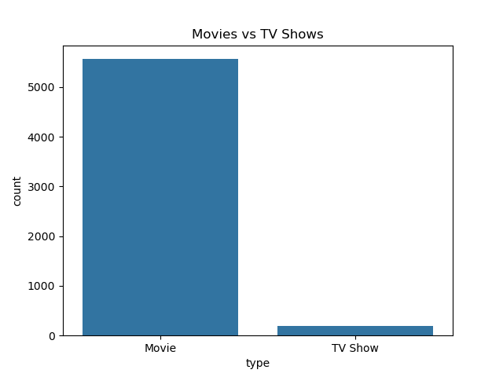
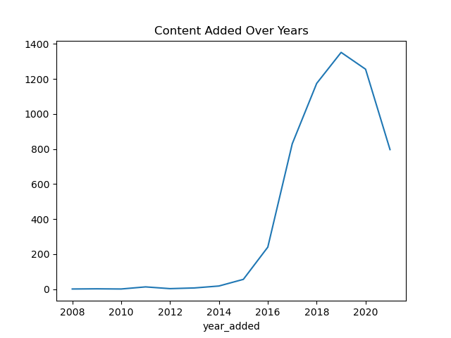

# 📺 Netflix Data Analysis Project

## 📌 Project Overview
This project analyzes the Netflix Movies and TV Shows dataset to uncover insights about content trends, genres, countries, and growth over time.  

The analysis is performed using Python and visualized using Matplotlib and Seaborn.

---

## 🛠️ Tools & Technologies
- Python 3.x  
- Pandas (Data Cleaning & Analysis)  
- Matplotlib & Seaborn (Data Visualization)  
- Jupyter Notebook  

---

## 📂 Dataset
The dataset contains information about Netflix content, including:
- Title  
- Director  
- Cast  
- Country  
- Release Year  
- Date Added  
- Rating  
- Duration  
- Genres (listed_in)  

Dataset used: `netflix_titles.csv`

---

## 🔍 Key Analysis Performed
- Movies vs TV Shows comparison  
- Top countries producing Netflix content  
- Content added over the years  
- Most common genres  
- Director analysis  

---

## 📊 Key Insights
- Netflix has more Movies than TV Shows  
- USA produces the majority of content  
- Content growth increased significantly after 2015  
- Popular genres include Documentaries, Dramas, and Comedies  

---

## 📸 Visualizations

### Movies vs TV Shows  

### Content Added Over the Years  

---

## 📁 Project Structure

Netflix-Data-Analysis/  
│  
├── netflix_titles.csv  
├── netflix_analysis.ipynb  
├── movies_vs_tv.png  
├── Content_Added_Over_Years.png  
└── README.md  

---

## ⚙️ How to Run This Project

### 1. Clone the repository
git clone https://github.com/ashutosh12-aa/Netflix-Data-Analysis.git

### Step 2: Navigate to project folder
cd Netflix-Data-Analysis

### Step 3: Install required libraries
pip install pandas matplotlib seaborn

### Step 4: Open Jupyter Notebook
jupyter notebook

### Step 5: Run the notebook
Open `netflix_analysis.ipynb` and run all cells.

---
## 📊 Results

- Successfully analyzed Netflix dataset using Python  
- Identified trends in content distribution and growth  
- Created visualizations to represent key insights  
- Gained hands-on experience in data analysis and visualization  

## 📈 Skills Demonstrated
- Data Cleaning and Preprocessing  
- Exploratory Data Analysis (EDA)  
- Data Visualization  
- Working with Real-World Dataset  
- Python Programming  

---

## 🚀 Future Improvements
- Create interactive dashboard using Power BI or Tableau  
- Perform sentiment analysis on movie descriptions  
- Compare Netflix with other OTT platforms (Amazon Prime, Disney+)  
- Build a recommendation system using Machine Learning  

---

## 👨‍💻 Author
**Ashutosh Ojha**  
📧 Email: ojha97858@gmail.com  
🔗 GitHub: https://github.com/ashutosh12-aa  

---

## ⭐ Support
If you like this project, please consider giving a ⭐ to the repository!
